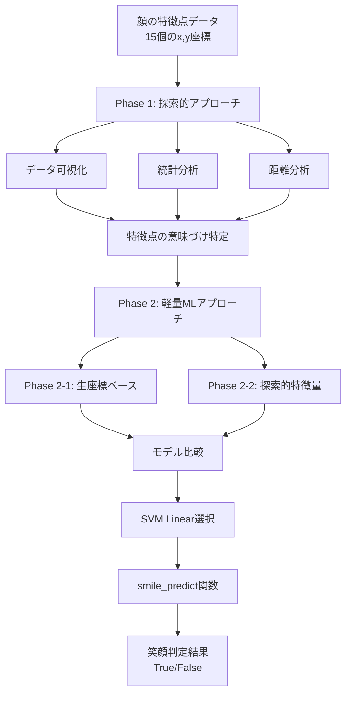
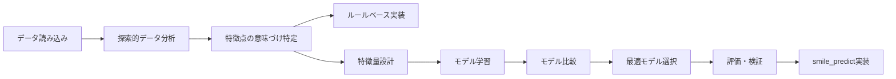

# Smile Detection

顔の特徴点（Keypoints）のみを用いた笑顔判定システム。探索的データ分析と軽量機械学習モデルにより、94%以上の精度とミリ秒未満の推論時間を実現。

## 📋 概要

本プロジェクトでは、顔画像ではなく15個の特徴点座標のみを使用して笑顔を判定するシステムを実装しました。プライバシーに配慮しつつ、リアルタイム処理に対応できる軽量な実装となっています。

### 主な特徴

- ✅ **高精度**: Test精度94.33%を達成
- ⚡ **高速**: 推論時間0.0090ms/sample（1秒あたり約111,000サンプル処理可能）
- 🪶 **軽量**: モデルサイズ約29KB
- 🔒 **プライバシー**: 顔画像ではなく特徴点座標のみを使用
- 📊 **探索的アプローチ**: データ可視化・統計分析・距離分析による特徴点の意味づけ特定

## 🏗️ アーキテクチャ



## 🔄 プロジェクトフロー



## 📊 モデル比較結果

| モデル | Test精度 | 推論時間 (ms/sample) | 評価 |
|--------|----------|---------------------|------|
| **SVM (Linear)** | **0.9433** | 0.0090 | **選択** |
| Logistic Regression | 0.9397 | 0.0013 | 精度がやや低い |
| Random Forest | 0.9078 | 0.0421 | 精度が低い |
| Naive Bayes | 0.8369 | 0.0011 | 精度が低い |

## 🚀 セットアップ

### 必要な環境

- Python 3.7以上
- Jupyter Notebook または JupyterLab

### インストール

```bash
# リポジトリをクローン
git clone https://github.com/your-username/smile-detection.git
cd smile-detection

# 必要なパッケージをインストール
pip install numpy scikit-learn matplotlib jupyter
```

### データセット

データセットは `data/facial_keypoints.json` に含まれています。

- Trainデータ: 657サンプル
- Testデータ: 282サンプル
- 特徴点数: 15個（各サンプルは15組の[x, y]座標）

## 💻 使用方法

### Jupyter Notebookでの実行

1. Jupyter Notebookを起動
```bash
jupyter notebook smile_detection.ipynb
```

2. ノートブック内のセルを順番に実行

3. `smile_predict()` 関数を使用して笑顔判定

### 関数の使用例

```python
from smile_detection import smile_predict

# 特徴点データの例
facial_data = [
    "sample_id",
    [x1, y1],  # 特徴点1
    [x2, y2],  # 特徴点2
    ...
    [x15, y15]  # 特徴点15
]

# 笑顔判定
result = smile_predict(facial_data)
print(result)  # True (笑顔) または False (非笑顔)
```

## 📈 性能評価

### 最終的な性能指標

- **Train精度**: 0.9391 (617/657)
- **Test精度**: 0.9433 (266/282)
- **学習時間**: 18.69ms
- **推論時間**: 0.0090ms/sample
- **モデルサイズ**: 約29KB

### 処理速度の詳細

- 1秒あたり約111,000サンプルを処理可能
- 30FPSの動画ストリームであれば余裕を持って処理可能
- リアルタイム処理の要件（16.67ms/フレーム以下）を大幅に上回る性能

## 🔍 探索的データ分析の結果

### 重要な特徴点の特定

| 特徴点 | 推測される顔の部位 | 重要性 |
|--------|------------------|--------|
| 13 | 上唇中央 | ⭐⭐⭐ 最重要（Y座標差3.00） |
| 14 | 下唇中央 | ⭐⭐ 重要（Y座標差2.48） |
| 11 | 左口角 | ⭐⭐ 重要（X座標差1.77、Y座標差1.94） |
| 12 | 右口角 | ⭐⭐ 重要（X座標差1.84、Y座標差1.88） |
| 10 | 鼻の先端 | ⭐ 参考（Y座標差0.41） |

### 重要な特徴点ペア間の距離

1. **ペア(13, 14)**: 距離差5.46（最大）→ 口の開き具合
2. **ペア(11, 12)**: 距離差3.65 → 口角間の距離
3. **ペア(10, 13)**: 距離差3.30 → 鼻と上唇の距離

## 📁 プロジェクト構成

```
smile-detection/
├── README.md                      # プロジェクト説明
├── smile_detection.ipynb          # メインの実装ノートブック
├── smile_detection_report.md      # 詳細な検証レポート
├── output.png                     # 特徴点の可視化結果
├── .gitignore                     # Git除外設定
└── data/
    └── facial_keypoints.json      # データセット
```

## 📚 詳細な分析結果

詳細な分析結果と実装の詳細については、[`smile_detection_report.md`](smile_detection_report.md) を参照してください。

## 🛠️ 技術スタック

- **Python**: メイン言語
- **NumPy**: 数値計算
- **scikit-learn**: 機械学習モデル（SVM, Logistic Regression, Random Forest, Naive Bayes）
- **Matplotlib**: データ可視化
- **Jupyter Notebook**: 開発環境

## 🎯 実装の特徴

### Phase 1: 探索的アプローチ

- データ可視化による特徴点の配置パターン分析
- 統計分析による特徴点の定量評価
- 距離分析による特徴点ペア間の関係性評価
- ルールベース実装の構築

### Phase 2: 軽量機械学習アプローチ

- Phase 2-1: 生座標ベースでのモデル比較
- Phase 2-2: 探索的特徴量ベースでのモデル評価
- 最終的にSVM Linearモデルを選択

## 🔬 実験結果の可視化

特徴点の配置パターンの可視化結果は `output.png` に保存されています。